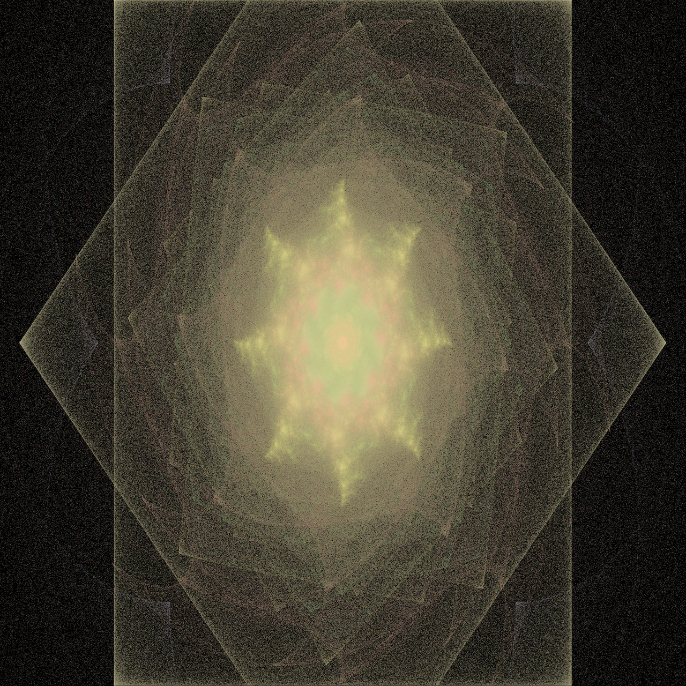
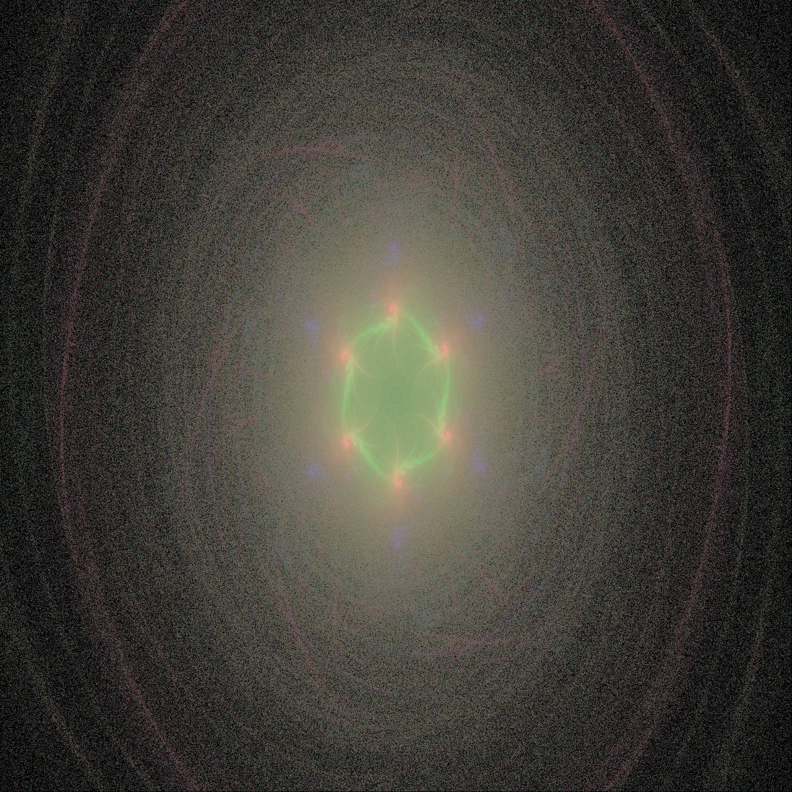
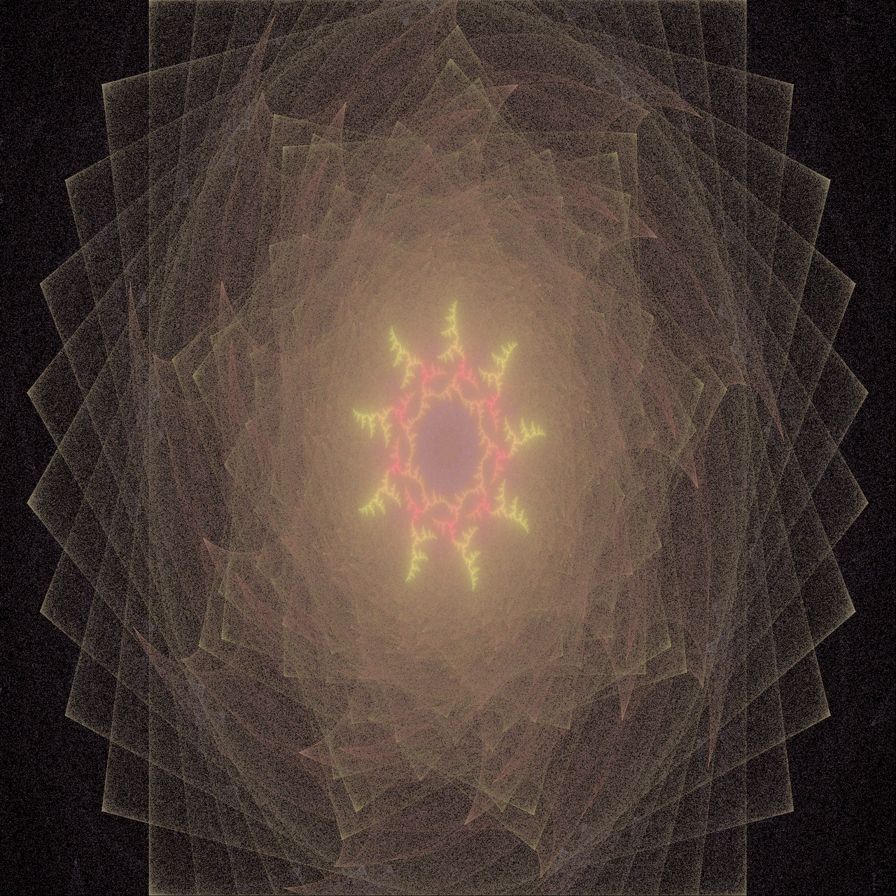
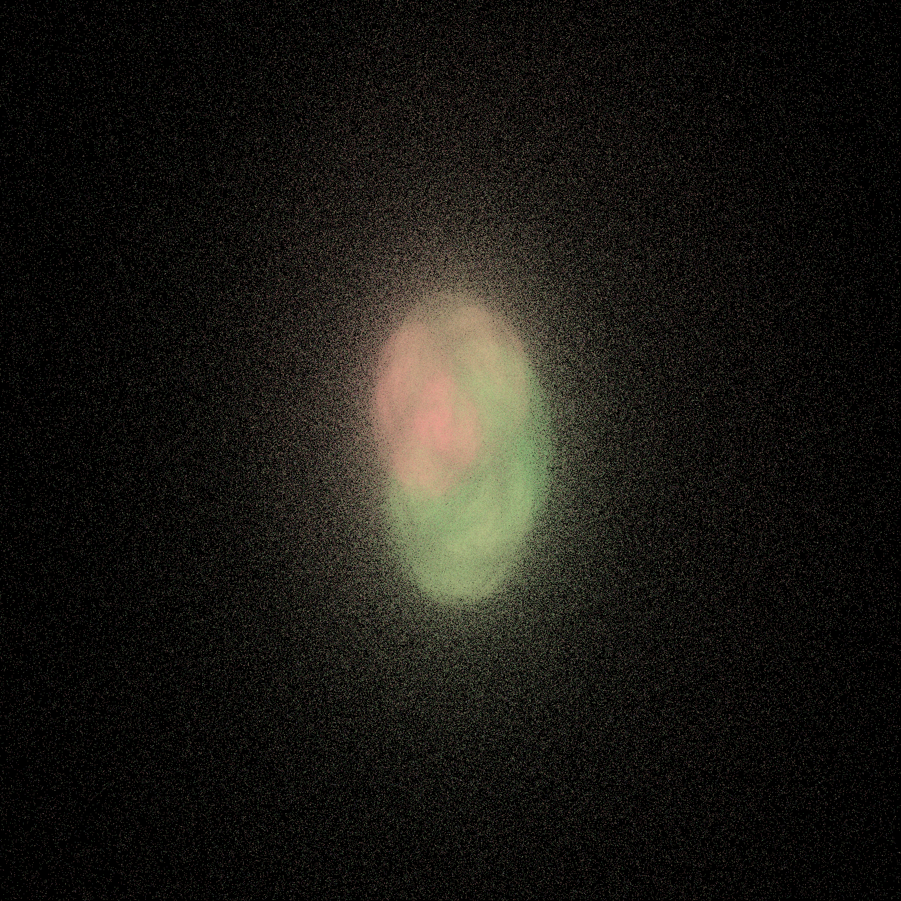
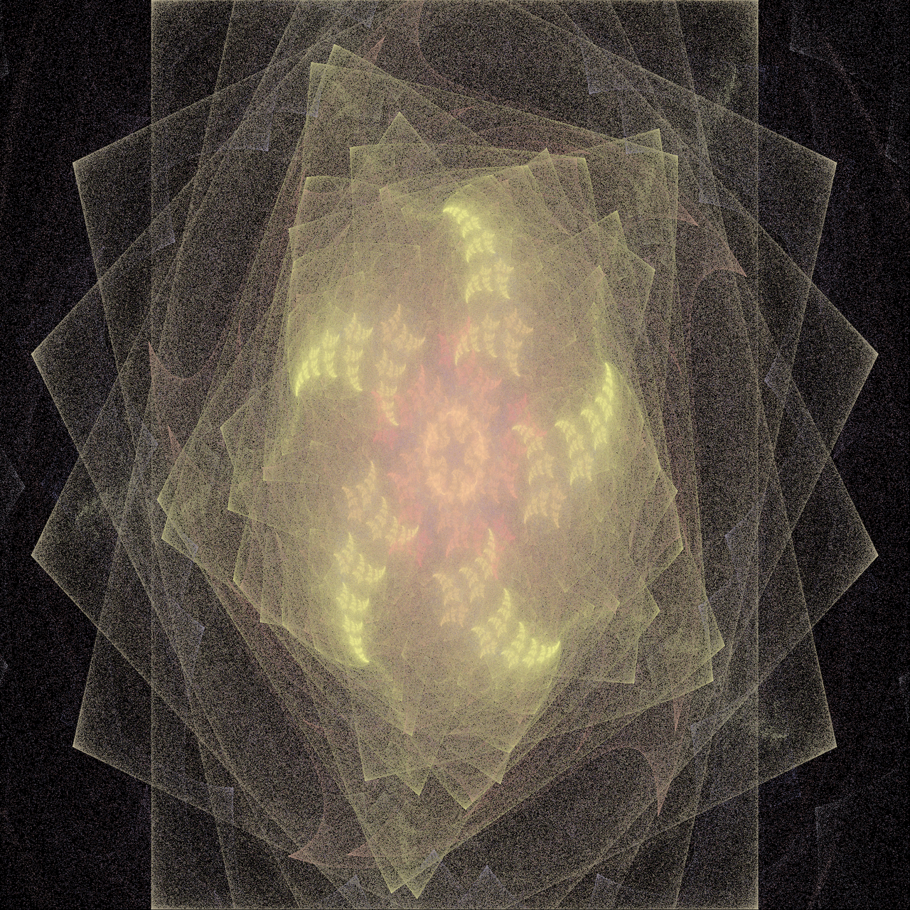
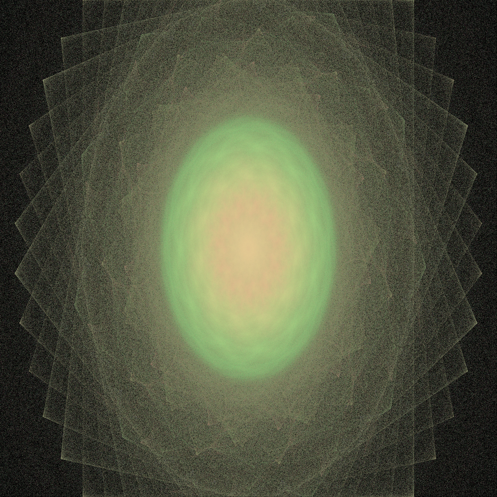
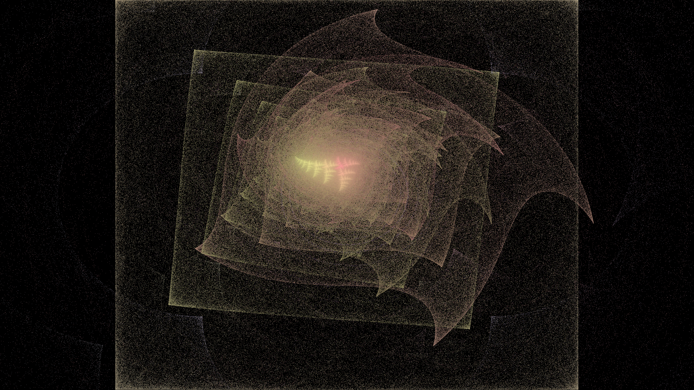
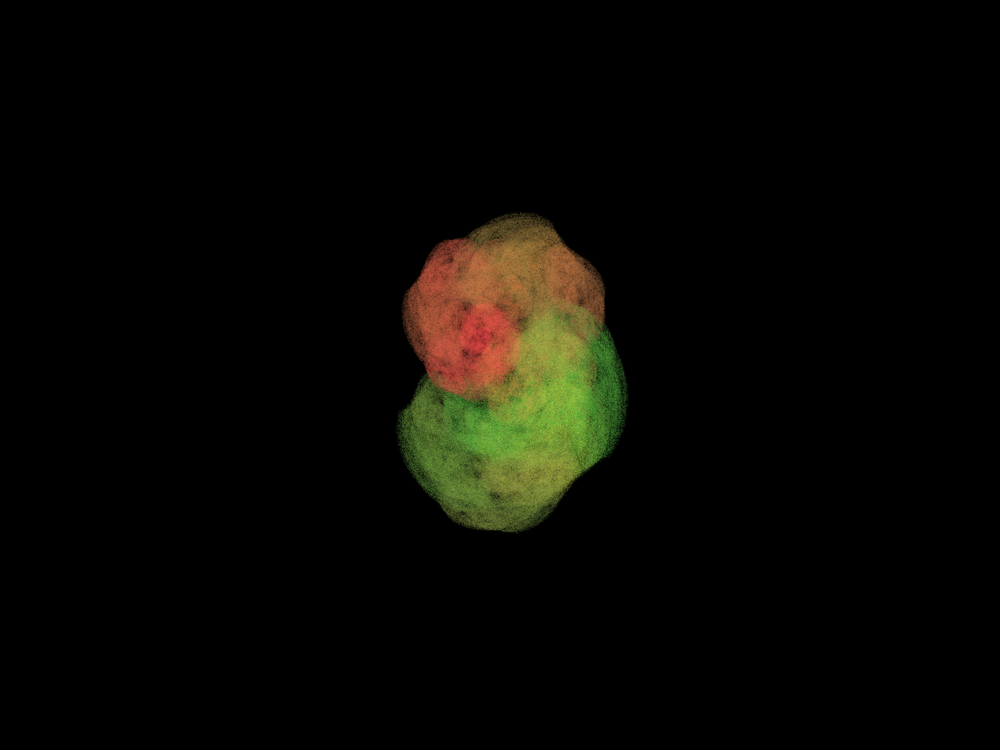
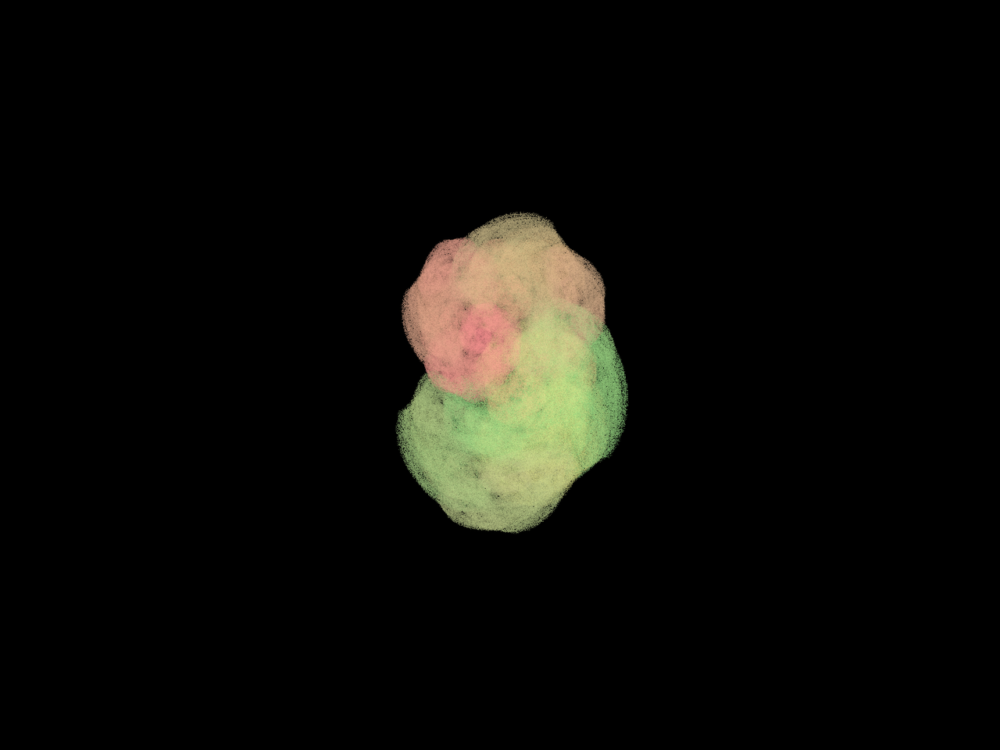

# Examples

This directory contains example fractal flame images and the configuration files
used to generate them.

The purpose of these examples is to demonstrate:

- supported transformations and their combinations;
- symmetry and gamma correction features;
- visual differences between various presets;
- reproducibility of results using configuration files.

All images were generated using the provided configurations without any manual post-processing.

---

## How to reproduce examples

Each image corresponds to a configuration file located in the `configs/` directory.

To reproduce any example, run:

```bash
poetry run python -m flame --config configs/<config_name>.json
```

Generated images will be saved to `examples/out/` as specified in the configuration.
You can then compare your result with the reference image stored in `examples/images/`.

---

## Gallery

### Pretty Flame

- Config: `configs/pretty_flame.json`
- Features:
    - multiple transformations
    - symmetry
    - gamma correction

```bash
poetry run python -m flame --config configs/pretty_flame.json
```


---

### Neon Flower (Symmetry 8)

- Config: `configs/neon_flower_sym8.json`
- Features:
    - radial symmetry (8-fold)
    - high color contrast

```bash
poetry run python -m flame --config configs/neon_flower_sym8.json
```



---

### Ember Ring (Symmetry 6)

- Config: `configs/ember_ring_sym6.json`
- Features:
    - ring-like structure
    - symmetry-based duplication

```bash
poetry run python -m flame --config configs/ember_ring_sym6.json
```



---

### Aurora (Symmetry 9)

- Config: `configs/aurora_sym9.json`
- Features:
    - soft gradients
    - high symmetry level
    - gamma correction

```bash
poetry run python -m flame --config configs/aurora_sym9.json
```



---

### Spiral Core

- Config: `configs/spiral_core.json`
- Features:
    - central spiral structure
    - no symmetry
    - swirl-dominated dynamics

```bash
poetry run python -m flame --config configs/spiral_core.json
```



---

### Constellation (Symmetry 5)

- Config: `configs/constellation_sym5.json`
- Features:
    - sparse, star-like structure
    - higher iteration count
    - symmetry emphasis

```bash
poetry run python -m flame --config configs/constellation_sym5.json
```



---

### Phoenix (Symmetry 11)

- Config: `configs/phoenix_sym11.json`
- Features:
    - high-order radial symmetry (11-fold)
    - four combined transformations
    - gamma correction

```bash
poetry run python -m flame --config configs/phoenix_sym11.json
```



---

### Soft Smoke

- Config: `configs/soft_smoke.json`
- Features:
    - no symmetry
    - soft, smoke-like gradients
    - gamma correction

```bash
poetry run python -m flame --config configs/soft_smoke.json
```



---

### Gamma Correction Comparison

These two examples demonstrate the effect of gamma correction on the final image.

#### Gamma OFF

- Config: `configs/gamma_off.json`

```bash
poetry run python -m flame --config configs/gamma_off.json
```



#### Gamma ON

- Config: `configs/gamma_on.json`

```bash
poetry run python -m flame --config configs/gamma_on.json
```



---

## Notes

- Visual appearance may slightly vary depending on platform, number of threads and floating-point behavior.
- Example images are provided for demonstration purposes and do not involve additional post-processing.